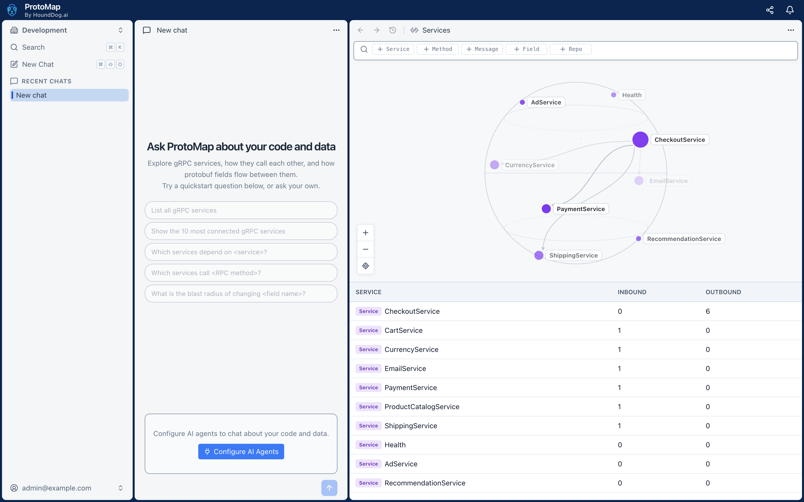
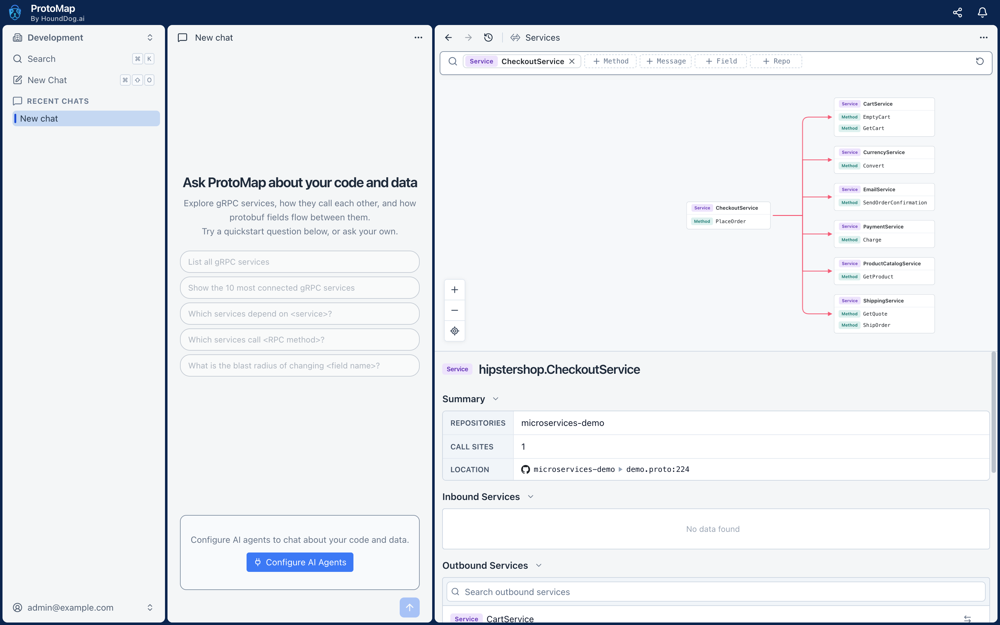
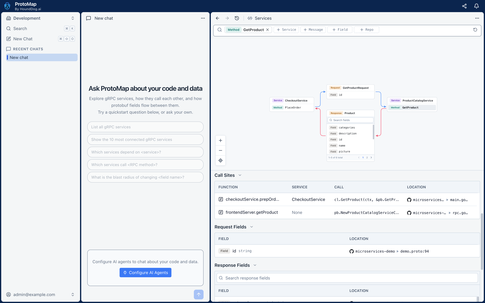

# ProtoMap

ProtoMap by HoundDog.ai maps your gRPC services: which services call which, through which methods and protobuf fields,
down to every call site. Run it on your own infrastructure, explore your architecture in its platform, ask its assistant
what a change would break, and give the same graph to coding agents such as Claude Code.



## What you can do

- **See your architecture.** Every gRPC service defined across your repositories, in monorepos or across
  microservices, and how the services connect through their methods and fields.
- **Assess the blast radius of a change.** Before you change a service, method, or field, see the services, consumers,
  and call sites it affects.
- **Find every call site of an RPC.** Which services call a method, in which file and function, and the call itself.
- **Ask the assistant.** It answers from your scans, with file locations, using the AI provider you connect.
- **Give coding agents the graph.** Over MCP, with your uncommitted changes laid over the shared graph.





## Install the platform

You need Docker with Compose 2.23.1 or newer, and at least 4 GB of RAM and 20 GB of disk space.

```shell
git clone https://github.com/hounddogai/protomap
cd protomap/self-hosted
./install.sh
```

Open the address the installer prints, enter the setup key it shows, and create your organization and its owner. The
setup then connects an AI provider for the assistant, such as Anthropic or OpenAI, with your own API key, and shows how
to install the CLI. See [`self-hosted/`](self-hosted/README.md) for more.

## Scan your repositories with the CLI

The ProtoMap CLI scans repositories on your computer and uploads the scans to your server. Install it on macOS or Linux:

```shell
curl -fsSL https://install.protomap.ai | sh
```

On Windows, in PowerShell:

```powershell
& ([scriptblock]::Create((irm https://install.protomap.ai/install.ps1)))
```

The scripts install the latest release from the [releases page](https://github.com/hounddogai/protomap/releases), after
checking it against the release's `SHA256SUMS`. The platform's setup shows the command for your server's version.

Log in to your server, then scan a repository:

```shell
protomap login --server=http://<your server>:3300
protomap scan /path/to/repository
```

`protomap login` opens the platform in your browser to approve the login. On a computer without a browser, such as a
VM over SSH, it prints a code instead: open `http://<your server>:3300/#/cli` in a browser on any computer and enter it.

Scans of a pushed commit on a repository's primary branch join the graph everyone in the organization sees. Your other
scans, such as of uncommitted changes, only show to you.

## Connect a coding agent

Add the CLI to your coding agent as an MCP server, from a repository's folder. While the agent runs, the CLI scans the
repository as files are saved, so the agent sees your changes laid over the graph:

```shell
claude mcp add protomap -- protomap mcp serve
```

Other agents run `protomap mcp serve` over standard input and output.

## Containers, CI, and other automation

Instead of logging in, set `PROTOMAP_URL` to your server and `PROTOMAP_API_KEY` to an API key from the platform's
**Settings > API Keys**:

```shell
export PROTOMAP_URL=http://<your server>:3300 PROTOMAP_API_KEY=<key>
protomap scan /path/to/repository
```

A personal key acts as you, and also serves `protomap mcp serve` to an agent. An organization key, which admins create
for continuous integration, scans without a member.
